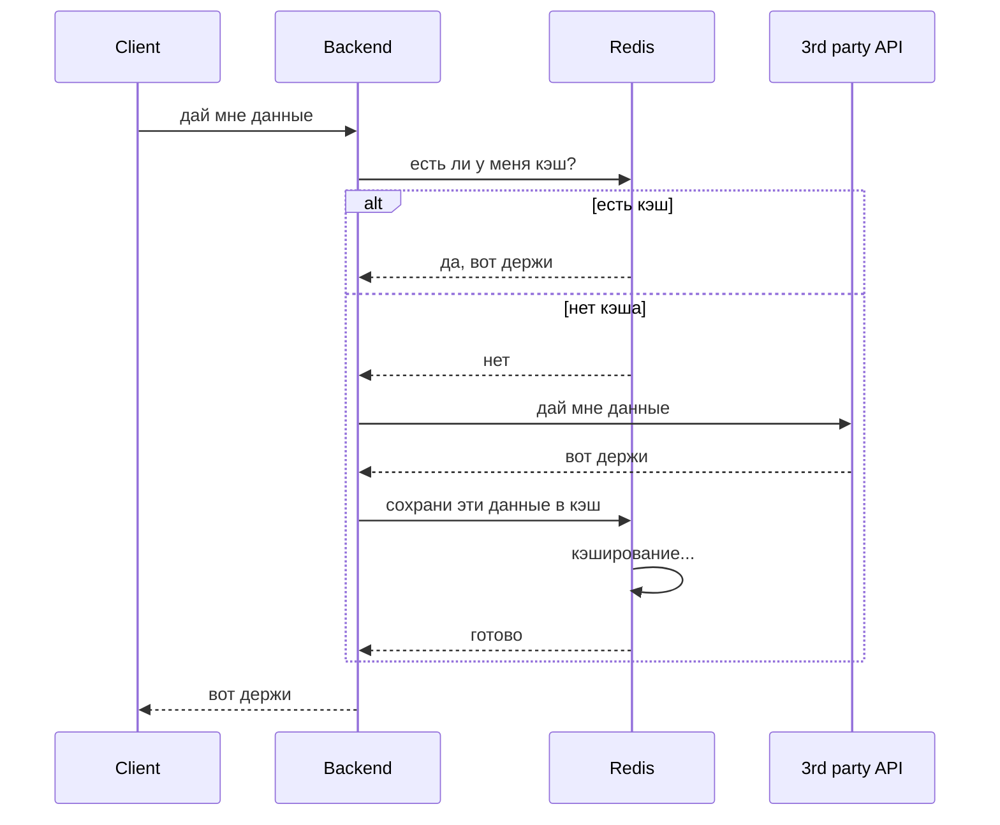

# UML Sequence diagram
На представленной UML Sequence Diagram визуализирован процесс взаимодействия компонентов системы при запросе данных — от клиента до бэкенда, 
кэша (Redis) и стороннего API. Диаграмма наглядно демонстрирует логику работы системы с учётом механизма кэширования, что критически важно для оптимизации производительности.

## Участники взаимодействия (participants)

#### Client — клиентское приложение (фронтенд), инициирующее запрос.
#### Backend — серверная часть системы, обрабатывающая логику.
#### Redis — кэш-система, хранящая часто используемые данные для ускорения доступа.
#### API (3rd party API) — сторонний сервис, предоставляющий необходимые данные.

## Последовательность взаимодействия:

Клиент (FE) отправляет запрос к бэкенду (BE) с просьбой предоставить данные (FE->>BE: дай мне данные).
Бэкенд проверяет наличие данных в кэше — обращается к Redis с запросом о наличии кэшированных данных (BE->>Redis: есть ли у меня кэш?).

