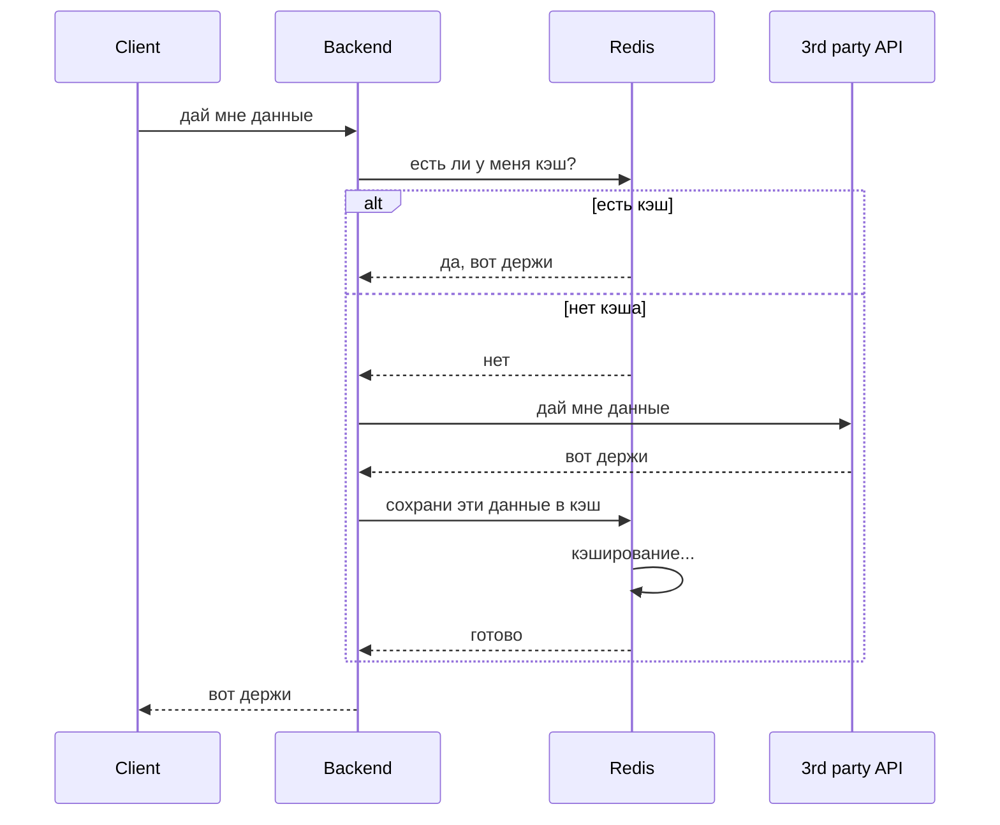

# UML Sequence diagram

```mermaid
sequenceDiagram
        participant FE as Client
        participant BE as Backend
        participant Redis
        participant API as 3rd party API

        FE->>BE: дай мне данные
        BE->>Redis: есть ли у меня кэш?

        alt есть кэш
            Redis-->>BE: да, вот держи
        else нет кэша
            Redis-->>BE: нет
            BE->>API:дай мне данные
            API-->>BE: вот держи
            BE->>Redis: сохрани эти данные в кэш
            Redis->>Redis: кэширование...
            Redis-->>BE: готово
        end

        BE-->>FE: вот держи
```
